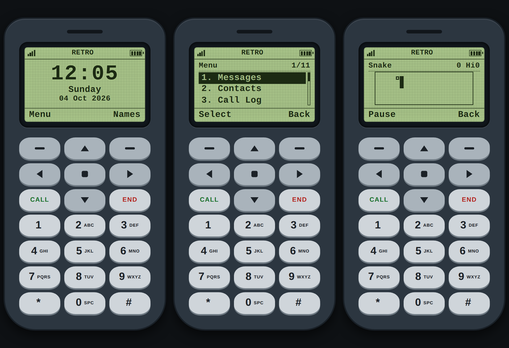

# Retro Phone Simulator

A classic feature phone on your Android screen. Green monochrome display, a real keypad, text messages typed with multi-tap, contacts, a call log, Snake and more. It works fully offline and needs no account.

## What you can do

- **Messages**: write with the old-style multi-tap keypad (press 2 once for A, twice for B), keep drafts, read inbox and sent
- **Contacts**: add, edit, delete, search, call or message a contact
- **Calls**: dial a number, see the calling screen, try incoming and missed calls, browse the call log
- **Games**: Snake and a Reaction test, both with saved high scores
- **Tools**: Calculator, Clock with stopwatch and countdown timer, Alarm, Calendar
- **Settings**: 3 colour themes (Classic Green, Monochrome, Dark Retro), sound and vibration, 12 or 24 hour time, Profiles (General, Silent, Vibrate only)
- **Remembers everything**: contacts, messages, call log, alarms, settings and high scores stay after you close the app

By default calls and messages are simulations: nothing is sent and no permission is needed. Turn on **Real mode** to place real calls and send real SMS (see below).

## Real calls and SMS

Menu, Settings, **Real mode**, then confirm. Android asks for permission to make calls and send SMS.

- Calls: dialling a number places a real phone call using your SIM. The normal phone call screen opens.
- SMS: messages you send go out as real text messages. Your carrier's SMS charges apply.
- **Import from phone** (Menu, Messages) copies your latest 50 received and 50 sent texts into the app.
- If a permission is denied, calls open the phone dialer instead and sending shows "Send failed" and keeps the text in Drafts.
- Turn Real mode off at any time to go back to the simulation.

**If Android will not show the SMS permission** (Android 13 and newer, apps installed from a file): open Android Settings, Apps, Retro Phone Simulator, tap the three dots at the top right and choose **Allow restricted settings**. Then turn Real mode on again.

Real mode works inside the app only. Incoming real calls and texts are not shown yet.

## Download and install (Android)

1. Open the [latest release](../../releases/latest) in your phone browser.
2. Under **Assets**, tap the file ending in **.apk** to download it.
3. Open the downloaded file. If Android says installing from this source is blocked, tap **Settings**, allow it for your browser or file manager, then go back and tap **Install**.
4. If Play Protect shows a warning, tap **More details** and then **Install anyway**. The app is not on the Play Store, which is why the warning appears.
5. Open **Retro Phone Simulator** from your app list.

To update, download the newest APK and install it over the old one. Your data stays.

### বাংলায় ইনস্টল

1. ফোনের ব্রাউজারে [সর্বশেষ release](../../releases/latest) খুলুন।
2. **Assets**-এর নিচে **.apk** দিয়ে শেষ হওয়া ফাইলে ট্যাপ করে ডাউনলোড করুন।
3. ডাউনলোড হওয়া ফাইল খুলুন। Android বাধা দিলে **Settings** চেপে ব্রাউজার বা ফাইল ম্যানেজারের জন্য অনুমতি দিন, তারপর **Install** চাপুন।
4. Play Protect সতর্কতা দিলে **More details** চেপে **Install anyway** দিন।
5. অ্যাপ লিস্ট থেকে **Retro Phone Simulator** খুলুন।

## How to use it

| Key | What it does |
|---|---|
| Left / right soft key (top row) | Does what the label at the bottom of the screen says |
| Arrow keys and the square middle key | Move and select (square = OK) |
| Number keys | Type, dial, or jump to menu items 1 to 9 |
| `#` while typing | Switch between Abc, abc, ABC and 123 |
| CALL | Dialled numbers on the home screen, accept an incoming call |
| END | Back to the home screen from anywhere |
| Android Back button | Go back one screen, exit from the home screen |

Press any number on the home screen to start dialling. Press the left soft key (**Menu**) to see everything the phone can do.

**Try a call or message:** Menu, Call Log, **Simulate incoming**. For a message: Menu, Messages, **Simulate incoming**.

## Good to know

- Alarms and the timer ring only while the app is open. Android pauses apps in the background.
- English only for now.
- Incoming real calls and SMS are not shown yet.
- To erase everything: Menu, Settings, **Reset app**.
- Privacy: the app does not collect or send any data. Everything stays on your phone. In Real mode the app only uses the call, send SMS and read SMS permissions you allow.

## For developers

Build, Termux and GitHub Actions instructions are in [DEVELOPING.md](DEVELOPING.md).

---

Retro Phone Simulator is an original design inspired by early feature phones. It is not affiliated with or endorsed by Nokia or any phone maker, and it contains no logos, fonts, sounds or software from them.
